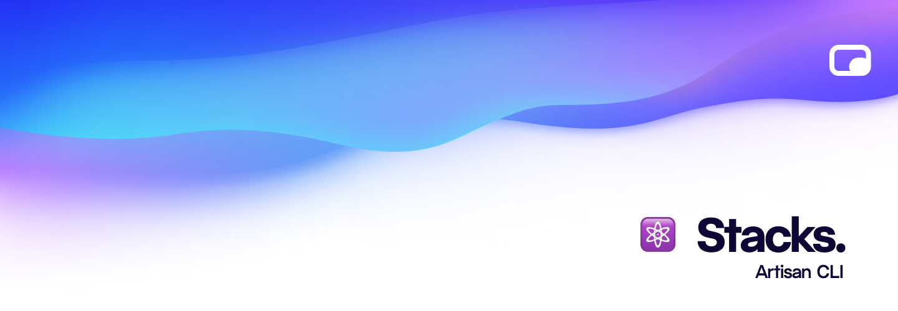

# Stacks CLI

[![npm version][npm-version-src]][npm-version-href]
[![GitHub Actions][github-actions-src]][github-actions-href]

[![npm downloads][npm-downloads-src]][npm-downloads-href]

The `npx artisan-init` source is stored here.

To learn more about how to get started, check out the [documentation](https://stacks.ow3org.com).

## 💪🏼 Contributing

Please see [CONTRIBUTING](.github/CONTRIBUTING.md) for details.

## 🏝 Community

For help, discussion about best practices, or any other conversation that would benefit from being searchable:

[Discussions on GitHub](https://github.com/stacksjs/stacks/discussions)

For casual chit-chat with others using this package:

[Join the Open Web Discord Server](https://discord.ow3.org)

## 📄 License

The MIT License (MIT). Please see [LICENSE](../LICENSE.md) for more information.

Made with ❤️

<!-- Badges -->
[npm-version-src]: https://img.shields.io/npm/v/artisan-init?style=flat-square
[npm-version-href]: https://npmjs.com/package/artisan-init

[npm-downloads-src]: https://img.shields.io/npm/dm/artisan-init?style=flat-square
[npm-downloads-href]: https://npmjs.com/package/artisan-init

[github-actions-src]: https://img.shields.io/github/workflow/status/stacksjs/stacks/CI/main?style=flat-square
[github-actions-href]: https://github.com/stacksjs/stacks/actions?query=workflow%3Aci
