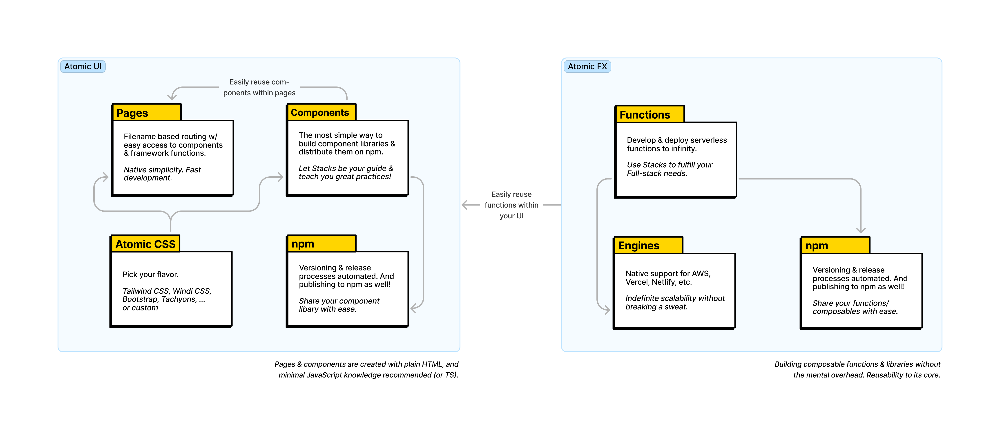

<p align="center"></p>

[![npm version][npm-version-src]][npm-version-href]
[![GitHub Actions][github-actions-src]][github-actions-href]
[](http://commitizen.github.io/cz-cli/)
<!-- [![npm downloads][npm-downloads-src]][npm-downloads-href] -->
<!-- [![Codecov][codecov-src]][codecov-href] -->

# The Atomic UI/FX Engine

The goal of the Stacks framework is to _help you_ create & maintain UIs _(pages & components)_ & function _(composables & APIs)_ libraries. The Stacks build system allows you to easily & automatically build highly-composable & scalable framework agnostic libraries—in beginner & expert-friendly ways—embodying [Composability-First Design](/apps/site/docs/composability-first-design.md) principles.



**🤖 Zero-config, by design**

The Stacks framework automagically bundles & builds your code. A Web Component library, Vue 2 & 3 libraries, a composable functions library or API, plus all of its relating type declarations. Out of plain HTML & minimal JavaScript. _The best of the Vite, Nitro & unbuild engines in a zero-config way._

**🎨 Style with ease**

Create your own style guide using conventions you are familiar with. Stacks' UnoCSS atomic engine allows for just that, in a blazing-fast, on-demand way. Tailwind CSS, Windi CSS, Bootstrap, Tachyons, Heroicons, Material Design Icons, and more to choose from.

**✨ Next-gen Developer Experience _(DX)_**

Whether it is the simplistic artisan setup & maintenance, the toolkit of accessible APIs, modern git commit conventions, a powerful, yet simple, CI, automated npm package releases & semver versioning, pretty changelog generations, automated PR dependency updates, built-in spell-checking, integrated documentation tooling, or the pre-configured examples... _Stacks has it all._

**💡 First-class VS Code integration**

IDE Capabilities, such as type hints, code completion, code formatting, and more—all natively built-into Stacks. _And without the need of Prettier._

**🧙🏼‍♀️ Extremely beginner & expert-friendly**

No matter whether you are a beginner or an expert, the approachable Stacks design allows you to learn at your own pace, using our thorough documentation covering every aspect of the framework.

Develop beautiful, reactive, composable UIs & functions without learning a new set of languages. HTML, CSS, and minimal JavaScript—that's all you need to dive in now! _(Or TypeScript ✌🏼)_

> _The clever way to build & share component & function libraries (and servers!)._

## Get Started

It's incredibly easy to get started with this framework. Simply run the following command in your terminal:

```bash
npx artisan setup
```

> **Note**
> Node.js v16.10 or higher required. _Stacks is `fnm` & `nvm` friendly._

## 🤖 Usage

The following list is of some of the most common ways to interact with the Stacks API. Meet the Artisan Toolkit:

```bash
# local workflow, to be released with 0.24.0
npx artisan install # installs all dependencies
npx artisan dev # starts one of the dev servers (components, functions, pages, or docs)
npx artisan build # follow CLI prompts to select which library (or server) to build
npx artisan commit # follow CLI prompts for committing changes
npx artisan release # creates the releases for the stack & consequently, publishes them to npm

npx artisan make:component HelloWorld # bootstraps a HelloWorld component
npx artisan make:function HelloWorld # bootstraps a HelloWorld function
npx artisan make:page hello-world # bootstraps a HelloWorld page (https://127.0.0.1/hello-world)

npx artisan help
```

<details>
<summary>View the complete Stacks Artisan Toolkit</summary>

```bash
npx artisan install # or `pnpm i`
npx artisan fresh # fresh reinstall of all deps

npx artisan dev # starts one of the dev servers (components, functions, pages, or docs)
npx artisan dev:components # starts local playground dev server
npx artisan dev:pages # starts local pages dev server
npx artisan dev:docs # starts local docs dev server

npx artisan make:component HelloWorld
npx artisan make:function hello-world
npx artisan make:page hello-world
npx artisan make:lang en
npx artisan make:stack hello-world

npx artisan stub # stubs all the libraries
npx artisan stub:components # stubs the component library
npx artisan stub:functions # stubs the function library
npx artisan stub:pages # stubs the pages

npx artisan lint # runs linter
npx artisan lint:fix # runs linter and fixes issues

npx artisan commit # follow CLI prompts for committing staged changes
npx artisan release # creates the releases for the stack & triggers the Release Action (workflow)
npx artisan changelog # generates CHANGELOG.md

# building for production (e.g. npm)
npx artisan build # select a specific build (follow CLI prompts)
npx artisan build:components # builds component libraries
npx artisan build:functions # builds function library
npx artisan build:elements # builds Web Component library (Custom Elements)
npx artisan build:vue # builds Vue 2 & 3 compatible libraries
npx artisan build:types # builds all types

# when building for Vercel, Netlify, and more
npx artisan deploy:playground
npx artisan deploy:docs

# creates a server to be deployed into any VPS
npx artisan server:functions # wip
npx artisan server:pages # wip

npx artisan example # select the example to run (follow CLI prompts)

# test your stack
npx artisan test # runs test suite
npx artisan test:unit # runs unit tests
npx artisan test:e2e # runs e2e tests
npx artisan test:coverage # runs test coverage
npx artisan test:types # runs typecheck
```

</details>

Read more here about the Stacks CLI in the documentation.

## 📚 Utilizing the Built Libraries

Because we optimize toward the development of easily reusable & composable component & function libraries, our primary intention is to always _keep it simple, yet configurable._

By default, Stacks realizes whether your Stack includes components, functions, and/or pages. Based on that determination, Stacks builds your outputs.

The UI libraries that automatically get built are a Web Component (Custom Elements) & Vue Component library.

<details>
<summary>Custom Element usage</summary>

```bash
npm install my-awesome-library
```

After you installed your Stacks generated library, you can use a "Custom Element" (Web Component) in the following way:

```html
<html>
  <body>
    <hello-world name="Jane Doe"></hello-world>
    <script src="my-awesome-library.js"></script>
  </body>
</html>
```
</details>

<details>
<summary>Vue 2 & 3 usage</summary>

```bash
npm install my-awesome-library
```

After you installed your Stacks generated library, you can use your Vue Components in the following way:

```vue
<script setup lang="ts">
import HelloWorld from 'my-awesome-library'
</script>

<template>
  <HelloWorld name="J Doe" />
</template>
```
</details>

_A function library may also be automatically generated._

<details>
<summary>Functions usage</summary>

```bash
npm install hello-world-library
```

After you installed your Stacks generated library, you can use your functions in the following way:

```ts
import { count, increment } from 'hello-world-library'

console.log('count is', count)

increment()

console.log('increased count is', count)
```
</details>

You may view this framework as an incredibly "useful set of frames" to assist in efficiently bootstrapping, designing, and managing component & function libraries—using industry best-practices, to reach one of the broadest user bases possible.

## 🚙 Roadmap

Part of the Stacks ecosystem are the following first-party supported stacks:

- [Table](https://github.com/ow3org/table-stack) (Q3 - Data tables with ease)
- [Date Picker](https://github.com/ow3org/date-picker-stack) (Q3 - Beautiful, modern date picker)
- [File Manager](https://github.com/ow3org/file-manager-stack) (Q3 - Build your own file manager—like Dropbox or Google Drive)
- [Image](https://github.com/ow3org/image-stack) (Q3 - Modern image experience)
- [Video](https://github.com/ow3org/video-stack) (Q3 - Modern video experience)
- [Audio](https://github.com/ow3org/audio-stack) (Q3 - Modern audio experience)
- [Web3](https://github.com/ow3org/web3-stack) (Q3 - Wallet Authentication, and more)
  - [NFT](https://github.com/ow3org/nft-stack) (Q3 - Solana NFTs, Candy Machine mechanisms, and more. _Ethereum & Cardano support coming._)
  - [DeFi](https://github.com/ow3org/defi-stack) (Q4 - Cross-chain DeFi engine, including staking support)
  - [DAO](https://github.com/ow3org/dao-stack) (Q4 - Powerful toolkit for DAO governance)

These stacks make great examples. Find more awesome Stacks [here](https://github.com/ow3org/awesome-stacks).

## 🧪 Testing

```bash
pnpm test
```

## 📈 Changelog

Please see our [releases](https://github.com/ow3org/stacks/releases) page for more information on what has changed recently.

## 💪🏼 Contributing

Please see [CONTRIBUTING](.github/CONTRIBUTING.md) for details.

## 🏝 Community

For help, discussion about best practices, or any other conversation that would benefit from being searchable:

[Discussions on GitHub](https://github.com/ow3org/stacks/discussions)

For casual chit-chat with others using this package:

[Join the Open Web Discord Server](https://discord.ow3.org)

## 📄 License

The MIT License (MIT). Please see [LICENSE](LICENSE.md) for more information.

Made with ❤️

<!-- Badges -->
[npm-version-src]: https://img.shields.io/npm/v/@ow3/hello-world-vue?style=flat-square
[npm-version-href]: https://npmjs.com/package/@ow3/hello-world-vue

[npm-downloads-src]: https://img.shields.io/npm/dm/@ow3/hello-world-vue?style=flat-square
[npm-downloads-href]: https://npmjs.com/package/@ow3/hello-world-vue

[github-actions-src]: https://img.shields.io/github/workflow/status/ow3org/stacks/CI/main?style=flat-square
[github-actions-href]: https://github.com/ow3org/stacks/actions?query=workflow%3Aci

<!-- [codecov-src]: https://img.shields.io/codecov/c/gh/ow3org/stacks/main?style=flat-square
[codecov-href]: https://codecov.io/gh/ow3org/stacks -->
