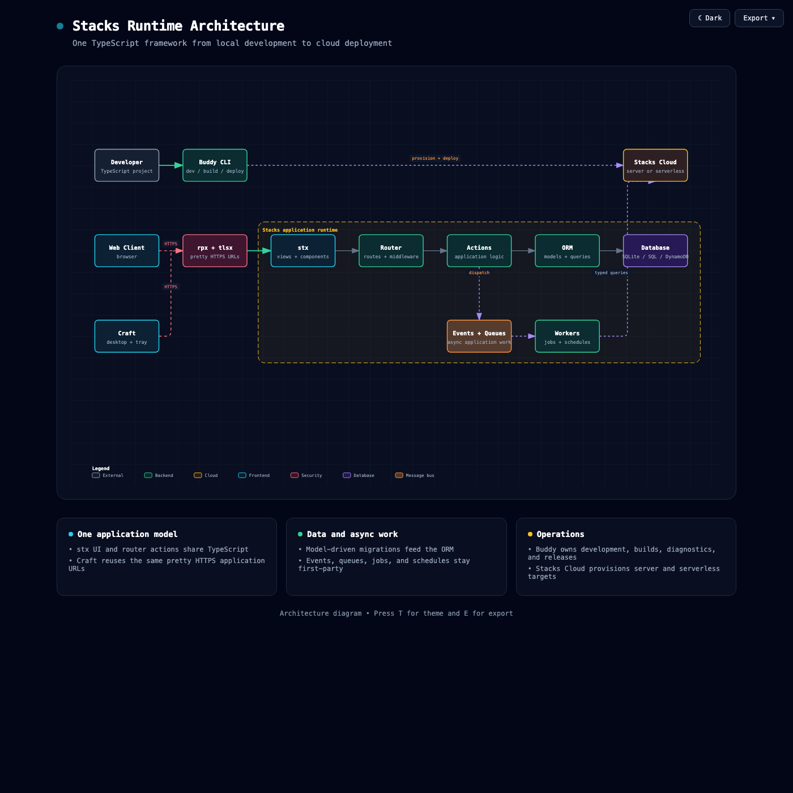

# Rapid App & Library Development

[](https://npmjs.com/package/stacks)
[](https://github.com/stacksjs/stacks/actions?query=workflow%3Aci)
[](http://commitizen.github.io/cz-cli/)
[](https://npmjs.com/package/stacks)
<!-- [![Codecov][codecov-src]][codecov-href] -->

> [!NOTE]
> Stacks is in active development and usable today — every section below
> is real, runnable functionality. Expect occasional breaking changes
> while we cut the official 1.0. Feedback and issue reports are welcome.

Stacks is a rapid development framework, where the goal is to _help you_ create & maintain frontends, backends, and clouds—without having to worry about the boilerplate. _An all-in-one toolkit that meets all your full stack needs._

[](./docs/diagrams/stacks-runtime.html)

_Open the diagram for light and dark themes plus SVG, PNG, JPEG, and WebP exports._

- Web & Desktop Applications _(including system tray apps)_
- Serverless & Traditional APIs
- Cloud Infrastructure Creation & Maintenance
- Interactive CLIs
- Framework-agnostic Component & Function Libraries
- Deployment & Release Manager _(CI & CD)_

## Convention Over Configuration

As a developer, Stacks helps you every step along the way—in beginner & expert-friendly ways, allowing you to focus on the _what & why_ of your project, all while enabling you to stay in control & ownership of your _(& your users’)_ data.

> “It is the framework’s responsibility to remove patterns that lead to boilerplate code. And Stacks is really good at that.” _- Chris_

<!--  -->

## Prerequisites

Stacks uses [Pantry](https://pantry.dev) to provision Bun, Git, SQLite, and the project-specific tools declared by the framework. You'll need:

- **Pantry** - install it with `curl -fsSL https://pantry.dev | bash`, then run `pantry bootstrap` once to configure your shell.
- **macOS, Linux, or WSL** - Windows-native support is on the roadmap. The current toolchain assumes a POSIX shell.

Pantry installs and pins Bun 1.3 or newer for each Stacks project, then keeps the rest of the machine and project dependencies in sync. Features such as PostgreSQL, Redis, and cloud deployment add their requirements through the same Pantry manifest where possible, with feature-specific configuration documented alongside them.

Stacks pins Pantry [`v0.10.36`](https://github.com/pantry-pm/pantry/tree/v0.10.36)
as an external toolchain contract. Resolution sources, lockfile and integrity
rules, lifecycle trust, registry routes, authentication, storage, and failure
modes are documented in the source-linked whitepaper references for the
[package manager](https://whitepaper.stacksjs.com/reference/package-manager) and
[registry](https://whitepaper.stacksjs.com/reference/registry). Stacks does not
redefine those behaviors.

## Get Started

The fastest path after Pantry is installed:

```bash
panx @stacksjs/buddy new my-project
```

Pantry executes Buddy in an isolated environment and provisions the generated project's declared toolchain during setup.

For frontend experiments in the browser, open the live stx starter:

[](https://stackblitz.com/fork/github/stacksjs/stackblitz?title=Stacks%20Starter)

## Usage

Stacks ships with `buddy`, a single CLI for everything you'll do day to day. The handful below covers the common workflows; the full reference is collapsed underneath.

```bash
buddy dev          # start the dev server (frontend, API, dashboard, …)
buddy build        # build for production (CLI prompts for what to build)
buddy test         # run tests
buddy migrate      # run database migrations
buddy make:action UpdateUser   # scaffold a new Action (also: model, view, job, …)
buddy --help       # show every available command
```

For the full command reference, see the collapsible section below or the [Buddy CLI documentation](https://stacksjs.org/docs/cli).

<details>
<summary>View the complete Buddy Toolkit</summary>

```bash
buddy --version # get the Stacks version
buddy --help # view help menu
# please note: you may suffix any command with the
# `command --help` flag to review the help menu

buddy new my-project # creates a new Stacks project
buddy install # installs dependencies
buddy add calendar # pulls a registered project-shaped stack into this project
buddy fresh # fresh reinstall of all deps (--force skips the confirmation)
buddy clean # removes all deps (--force skips the confirmation)
buddy setup # sets up the project initially
buddy setup:oh-my-zsh # optional: sets up Oh My Zsh with auto-completions & "aliases"

buddy upgrade # upgrades the Stacks framework (alias: buddy update)
buddy upgrade:dependencies # auto-upgrades package.json deps
buddy upgrade:shell # upgrades the shell integration
buddy upgrade:binary # upgrades the `stacks` binary
buddy upgrade:bun # upgrades to latest project-defined Bun version
buddy upgrade:all # auto-upgrades all of the above

# if you need any more info on any command listed here, you may suffix
# any of them via the "help option", i.e. `buddy ... --help`

buddy dev # starts the dev servers (frontend, api & docs)
buddy dev -i # prompts you to select which dev server to start
buddy dev:api # starts the API dev server
buddy dev:dashboard # starts the Admin/Dashboard dev server
buddy dev:desktop # starts the Desktop dev server
buddy dev:views # starts frontend dev server
buddy dev:components # starts component dev server
buddy dev:docs # starts local docs dev server
buddy dev docs # also starts the local docs dev server (dev takes the server name as an argument)

buddy share # creates a sharable link to your local project

# production servers (the same entries the deploy target runs as services)
buddy serve # starts the production HTTP server (STX views + /api proxy)
buddy serve:api # starts the production API server

# building for production (e.g. AWS, Google Cloud, npm, Vercel, Netlify, et al.)
buddy build # select a specific build (follow CLI prompts)
buddy build:frontend # builds the frontend (aliases: build:views, build:pages)
buddy build:desktop # builds Desktop application
buddy build:functions # builds function library
buddy build:components # builds the STX component library and Web Component library
buddy build:web-components # builds framework agnostic Web Component library (i.e. Custom Elements)
buddy build:cli # builds the Buddy CLI binary
buddy build:server # builds the Stacks cloud server (Docker image)
buddy build:docs # builds the documentation site

# `buddy build:*` aliases
buddy prod:components # alias for build:components
buddy prod:desktop # alias for build:desktop
buddy prod:web-components # alias for build:web-components
buddy prod:frontend # alias for build:frontend
buddy prod:cli # alias for build:cli
buddy prod:server # alias for build:server
buddy prod:docs # alias for build:docs
buddy prod:frontend-static # alias for build:frontend-static

# sets your application key
buddy key:generate

buddy make:component HelloWorld # bootstraps a HelloWorld component
buddy make:function hello-world # bootstraps a hello-world function
buddy make:view hello-world # bootstraps a hello-word page
buddy make:model Car # bootstraps a Car model
buddy make:database cars # prints guidance: tables come from models + migrations, there is no separate create step
buddy make:migration create_cars_table # creates a cars migration file
buddy make:factory cars # creates a Car factory file
buddy make:notification welcome-email # bootstraps a welcome-email notification
buddy make:lang de # bootstraps a lang/de.yml language file
buddy make:stack my-plugin # scaffolds a project-shaped registry stack (new project? use `panx @stacksjs/buddy new`)

buddy migrate # runs database migrations
buddy migrate:fresh # drops all tables & re-runs migrations (destroys all data; --seed reseeds)
buddy migrate:dns # sets the ./config/dns.ts file
buddy seed # runs database seeders

buddy dns example.com # list all DNS records for example.com
buddy dns example.com --type MX # list MX records for example.com

buddy http example.com/api/hello # sends a GET request & prints the response
buddy http -v example.com/api/get # same, with verbose output

buddy lint # runs linter
buddy lint:fix # runs linter and fixes issues
buddy format # formats your project codebase
buddy format:check # checks formatting without making changes

buddy commit # follow CLI prompts for committing staged changes
buddy release # creates the releases for the stack & triggers the Release Action (workflow)
buddy changelog # generates CHANGELOG.md

# when deploying your app/s to a remote server or cloud provider
buddy deploy # select a specific deployment (follow CLI prompts)
buddy undeploy # be careful: "undeploys" removes/deletes your deployed resources (--yes skips the confirmation)

buddy cloud:remove # removes cloud setup
buddy cloud:cleanup # removes cloud setup & cleans up all potentially leftover resources
buddy cloud:add --jump-box # adds a jump box to your cloud setup

# you likely won’t need to run these commands as they are auto-triggered, but they are available
buddy generate  # prompts you to select which generator to run
buddy generate:types # generates types for your components, functions, & views
buddy generate:entries # generates entry files for components, functions, & views
buddy generate:web-types # generates Web Component types
buddy generate:vscode-custom-data # generates VSCode custom data
buddy generate:ide-helpers # generates IDE helpers
buddy generate:component-meta # generates component meta

# generates your application key
buddy key:generate # generates your application key

# manage your environment variables
buddy env:get # get an environment variable
buddy env:set # set an environment variable
buddy env:encrypt # encrypt an environment variable
buddy env:decrypt # decrypt an environment variable
buddy env:keypair # generate a keypair
buddy env:rotate # rotate a keypair

# generate your TypeScript declarations
buddy types:generate # generates types for your components, functions, & views
buddy types:fix # auto-fixes types for your components, functions, & views

buddy domains:add stacksjs.com # adds a domain
buddy domains:remove stacksjs.com # removes a domain
buddy domains:purchase stacksjs.com # purchase a new domain

# handy utilities
buddy doctor # runs health checks on your Stacks installation
buddy list # lists all available Buddy commands
buddy route:list # lists your routes
buddy ports # checks your project for port issues & misconfigurations
buddy outdated # lists outdated project dependencies
buddy env:check # checks your environment configuration & validates setup
buddy tinker # interactive REPL with the Stacks framework preloaded
buddy down # puts the app into maintenance mode
buddy up # brings the app out of maintenance mode

# test your stack
buddy test # runs your test suite
buddy test:unit # runs unit tests
buddy test:feature # runs feature tests
buddy test:types # runs typecheck

# the published @stacksjs/buddy package ships
# `buddy`, `bud`, & `stx` bins; inside this repo
# the CLI is invoked as ./buddy
./buddy fresh
```

</details>

Read more about the Buddy CLI in the [official docs](https://stacksjs.org/docs/cli) — every command, every flag, every prompt explained.

## Features

The Stacks framework is a harmony of several “engines” to build any web and/or desktop application, in highly scalable & privacy-friendly ways. It consists of the following engines:

### Frontend Development

_Develop dynamic UIs with helpers for atomic design, and much more._

- 🧩 **Components** _primitive to develop user interfaces_
- 🤖 **Functions** _primitive to develop business logic (and grant your UI superpowers)_
- 🎨 **UI Kit** _modern & deeply-integrated components_
- 🌐 **Web** _“a routing & templating engine that makes sense”_
- 🖥️ **Desktop** _transforms your web app into a desktop app, plus more_
- 📝 **Documentation** _markdown-based documentation, auto-generated_
- 📚 **Library** _auto-builds & manages component & function libraries_
- ⚡️ Powered by Bun, Craft, Headwind

### Backend Development

_Develop serverless (or server) functions with countless helpers to build scalable & fast APIs._

- 🪄 **AI** _deep AI integrations to simplify building agentic workflow_
- 🤖 **APIs** _scalability & maintainability built-in_
- 🏎️ **Cache** _unified caching for DynamoDB, Redis and more_
- ⚙️ **CLIs** _create beautiful CLIs for Linux, Windows, and Mac (dependency-free binaries)_
- 🛍️ **Commerce** _own & grow your own online business with ease (SaaS-optimized)_
- 📀 **Database** _DynamoDB, SQLite, MySQL, Postgres, and more_
- 👾 **Errors** _native type-safe error handling_
- 🗓️ **Events** _functional event (front & backend) communication_
- 📢 **Notifications** _emails, SMSs, direct, and push notifications & webhooks_
- 🗺️ **ORM** _automated schemas for scale & a pretty API_
- 💳 **Payments** _unified API for one-off & subscription billing methods for Stripe_
- ⚙️ **Queues** _run any heavy workload in the background_
- 🛠️ **Query Builder** _powerful, type-safe SQL query builder_
- 💬 **Realtime** _“everything you need to build dynamic real-time apps”_
- 🧭 **Router** _smart routing, file-based or Laravel-like_
- 🔎 **Search Engine** _smart searching, advanced filtering & sorting, pagination, headless UI_
- 💾 **Storage** _a secure-by-default File API that feels right_
- 🧪 **Tinker** _a powerful TypeScript REPL_
- 🌪️ **Validation** _e2e type-safety (true frontend & backend harmony)_

### Cloud Development

_Develop & maintain cloud infrastructure with ease. “Imagine Vercel, Vapor and Forge having been unified.”_

- ☁️ **Server** _local development server & production-ready servers out-of-the-box_
- ⛅️ **Serverless** _on-demand, auto-scaling, zero maintenance_
- ⏰ **Alarms** _built-in cloud infrastructure monitoring to avoid surprises_
- 🚏 **CDN** _zero-config, low-latency, request life-cycle hooks, optimized request compressions (Brotli & gzip)_
- 🔀 **Domain** _version-controlled & zero-config domain management (e.g. DNS management)_
- 🤖 **AI** _fine-tune a foundational model using your application data_
- 📧 **Email** _secure & zero-setup <easy-peasy@custom-domains.com> mailboxes_
- 🔐 **Firewall** _native web application firewall support_
- 📦 **Storage** _unlimited cloud storage & automatic backups_
- 🚜 **Maintenance** _maintain your cloud infrastructure with ease using Buddy & Stacks_
- 🚦 **Infrastructure as Code** _version-controlled cloud infrastructure (AWS, Google next?)_

### CI/CD

_Focus on coding, not publishing._

- 🚀 **Deployment Manager** _takes the sweat out of production deployments—zero-setup push-to-deploy_
- 0️⃣ **Zero Downtime** _deploy with confidence using a zero-downtime deployment strategy_
- 📫 **Release Manager** _libraries (component & function) auto-published to npm, git helpers, and more_

### Developer Experience (DX)

Convention over configuration, while staying wholly configurable. _No more boilerplate._

- 💎 **Automated Upgrades** _no need to worry about upgrading to the latest versions, Stacks upgrades you_
- 🦋 **Pretty Dev URLs** _your-project.localhost instead of localhost:3000_
- 💡 **IDE Integration** _auto-completions, inline docs & a powerful IDE setup_
- 🪄 **Zero-Config** _yet highly configurable—convention over configuration_
- 💅 **Linter & Formatter** _auto-configured & built into your IDE_
- 💪🏼 **Type Strong** _built-in e2e type-safety_
- ✨ **Git Workflows** _committing with ease_
- 🚗 **Auto Imports** _your components & functions, including date, string, array, & object helpers_
- ⏩ **Code Snippets** _goodbye to the boilerplate code—thank you Sarah Drasner_
- 🔤 **Spell Checker** _be notified once there are typos_
- 🛠️ **Essential Utilities** _powers at your fingertips. Collections, STX composables, and more_
- 👥 **Team Management** _manage your team & their permissions_
- 🧪 **Streamlined Testing** _unit & e2e tests powered by Bun, Vitest & Playwright_

No matter whether you are a beginner or an expert, the approachable Stacks design allows you to learn at your own pace, using our thorough documentation covering every aspect of the framework. Stacks is extremely beginner & expert-friendly.

Develop beautiful, reactive, composable UIs without learning a new set of languages. HTML, CSS, and minimal JavaScript—that’s all you need to dive in now! _Or TypeScript ✌🏼_

> _An actual rapid application development framework for all Full Stack needs. Next-level simplicity & DX._

## Testing

```bash
./buddy test
```

## Changelog

Please see our [releases](https://github.com/stacksjs/stacks/releases) page for more information on what has changed recently.

## Contributing

Please see the [Contributing Guide](https://github.com/stacksjs/contributing) for details.

## Community

For help, discussion about best practices, or any other conversation that would benefit from being searchable:

[Discussions on GitHub](https://github.com/stacksjs/stacks/discussions)

For casual chit-chat with others using this package:

[Join the Stacks Discord Server](https://discord.gg/stacksjs)

## Postcardware

“Software that is free, but hopes for a postcard.” We love receiving postcards from around the world showing where Stacks is being used! We showcase them on our website too.

Our address: Stacks.js, 12665 Village Ln #2306, Playa Vista, CA 90094, United States 🌎

## Sponsors

We would like to extend our thanks to the following sponsors for funding Stacks development. If you are interested in becoming a sponsor, please reach out to us.

- [JetBrains](https://www.jetbrains.com/)
- [The Solana Foundation](https://solana.com/)

## Credits

- [Laravel](https://laravel.com) _many thanks to their community_
- [Chris Breuer](https://github.com/chrisbbreuer)
- [All Contributors](../../contributors)

And a special thanks to [Dan Scanlon](https://twitter.com/danscan) for donating the `stacks` name on npm ✨

## License

The MIT License (MIT). Please see [LICENSE](LICENSE.md) for more information.

Made with 💙

<!-- Badges -->
[npm-version-src]: https://img.shields.io/npm/v/stacks?style=flat-square
[npm-version-href]: https://npmjs.com/package/stacks

[npm-downloads-src]: https://img.shields.io/npm/dm/stacks?style=flat-square
[npm-downloads-href]: https://npmjs.com/package/stacks

[github-actions-src]: https://img.shields.io/github/actions/workflow/status/stacksjs/stacks/ci.yml?style=flat-square&branch=main
[github-actions-href]: https://github.com/stacksjs/stacks/actions?query=workflow%3Aci

<!-- [codecov-src]: https://img.shields.io/codecov/c/gh/stacksjs/stacks/main?style=flat-square
[codecov-href]: https://codecov.io/gh/stacksjs/buddy -->
